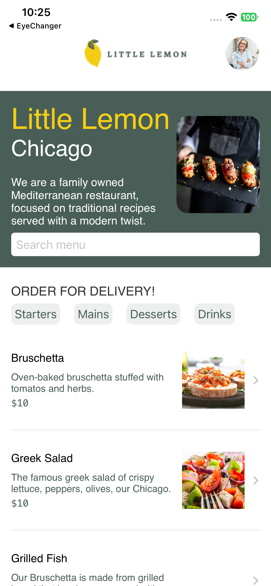
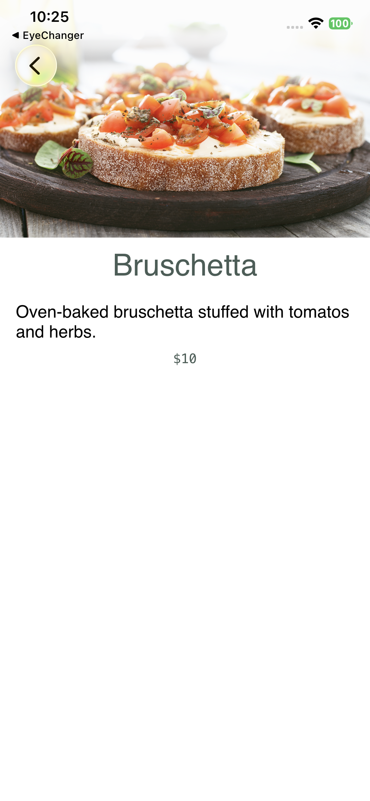
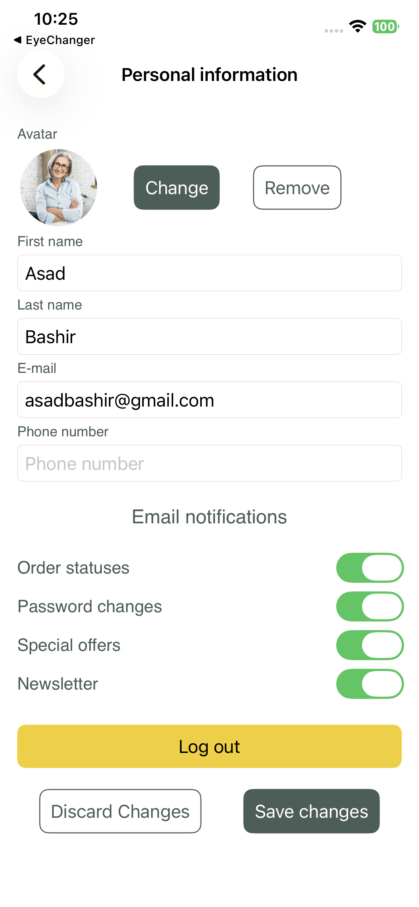
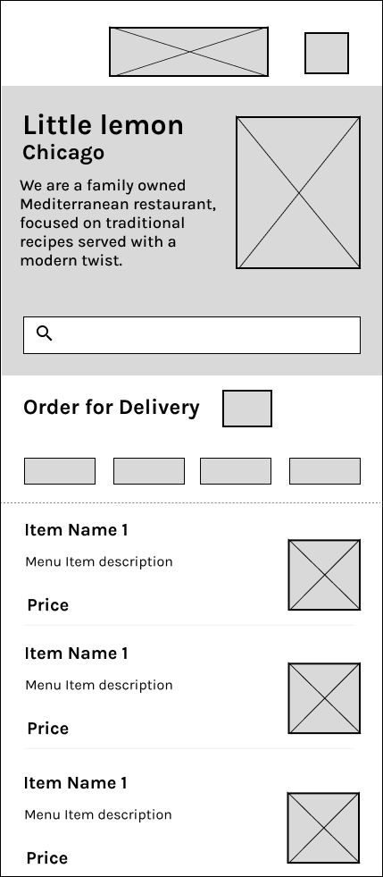
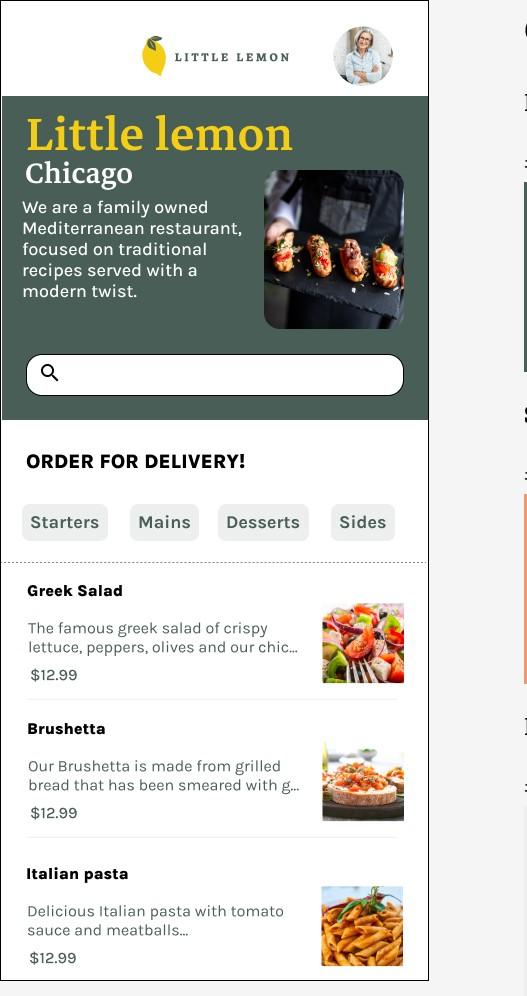

# Little Lemon

A SwiftUI iOS app for the **Little Lemon** restaurant. Browse the menu by category, search dishes, view details, and manage your profile—with onboarding and persistent preferences.

---

## Features

- **Onboarding & registration** — First name, last name, and email with validation; login state persisted via `UserDefaults`
- **Menu browsing** — Hero section, search bar, and category toggles (Starters, Mains, Desserts, Drinks)
- **Menu data** — Fetched from a remote JSON API, stored in Core Data, and displayed with `FetchedObjects`
- **Dish details** — Tap a dish to see image, title, description, and price
- **User profile** — Avatar placeholder, editable profile fields, notification preferences (order statuses, password changes, special offers, newsletter), and logout

---

## Screenshots

| Home (Menu) | Dish detail | Profile |
| :---------- | :---------- | :------ |
|  |  |  |

### Wireframes

| Initial wireframe | Final wireframe |
| :---------------- | :-------------- |
|  |  |

---

## Tech stack

- **SwiftUI** — UI and navigation
- **Core Data** — Local menu data and `Dish` entity
- **Combine / ObservableObject** — View model for validation and user prefs
- **UserDefaults** — Login state and profile/notification preferences
- **URLSession** — Fetching menu JSON from [Meta’s Working-With-Data-API](https://github.com/Meta-Mobile-Developer-PC/Working-With-Data-API)

---

## Project structure

```
Little Lemon Final/
├── Little Lemon Final/
│   ├── Little_Lemon_FinalApp.swift   # App entry, Onboarding + Core Data context
│   ├── Views/
│   │   ├── Onboarding.swift         # Registration form & validation
│   │   ├── Home.swift               # Wraps MainScreen after login
│   │   ├── MainScreen.swift         # Header + Menu
│   │   ├── Header.swift             # Logo & profile link
│   │   ├── Hero.swift               # Hero banner
│   │   ├── Menu.swift               # Search, category toggles, dish list
│   │   ├── FoodItem.swift           # Row view for a dish
│   │   ├── DetailItem.swift         # Dish detail (image, title, description, price)
│   │   └── UserProfile.swift        # Profile & notification settings
│   ├── ViewModels/
│   │   └── ViewModel.swift          # Validation, UserDefaults keys & prefs
│   ├── Models/
│   │   ├── MenuItem.swift           # Codable menu item (API)
│   │   └── MenuList.swift           # API fetch & Core Data sync
│   ├── CoreData/
│   │   ├── Persistence.swift        # NSPersistentContainer, in-memory store
│   │   ├── FetchedObjects.swift     # SwiftUI fetch wrapper
│   │   └── ExampleDatabase.xcdatamodeld
│   ├── Styles.swift                 # Button & text styles, custom colors
│   └── Assets.xcassets/
├── screenshots/
│   ├── home_screen.PNG
│   ├── detail_screen.PNG
│   ├── profile_screen.PNG
│   ├── wireframe.jpg
│   └── wireframe_final.jpg
├── README.md
└── Little Lemon Final.xcodeproj/
```

---

## Requirements

- Xcode (Swift 5, iOS target as set in the project)
- iOS device or simulator

---

## How to run

1. Open `Little Lemon Final.xcodeproj` in Xcode.
2. Select a simulator or device.
3. Build and run (⌘R).

On first launch you’ll see the onboarding screen; after registering you’ll land on the home menu. The menu is loaded from the remote API and cached in Core Data.

---

## Author

**asadbyte**

---

## License

This project is for educational use (e.g. Meta iOS Developer coursework).
